# Recipe Management System

A React Native app for managing recipes, meal planning, inventory tracking, and more, optimized for iOS and (future) Android support. This project allows users to explore, save, and manage recipes, with additional features for meal planning and inventory management.

## Table of Contents
- [Features](#features)
- [Installation](#installation)
- [Usage](#usage)
- [Demo](#demo)
- [Contributing](#contributing)
- [License](#license)

## Features

### 1. User Authentication
- **Sign Up**: New users can create an account with their username, email, and password.
- **Login**: Existing users can log in to their accounts by entering their credentials.
- **Forgot Password**: Users can recover their account by providing an email address, and a reset link will be sent to them.

| Sign Up | Login | Forgot Password |
|---------|-------|-----------------|
| 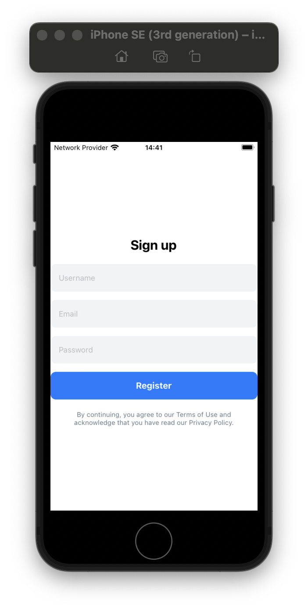 | 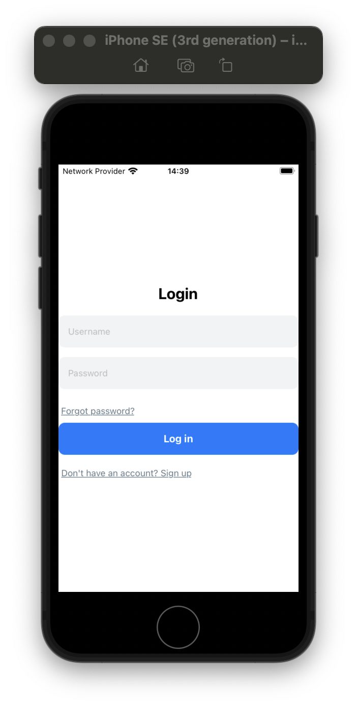 | 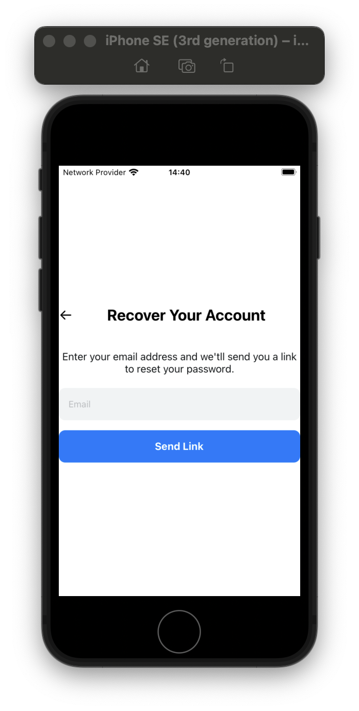 |

### 2. User Profile
- **Profile Page**: Users can view and edit their profile details such as username and email.
- **Edit Profile**: Allows users to modify their profile information and save updates.

| Profile Page | Edit Profile |
|--------------|--------------|
| 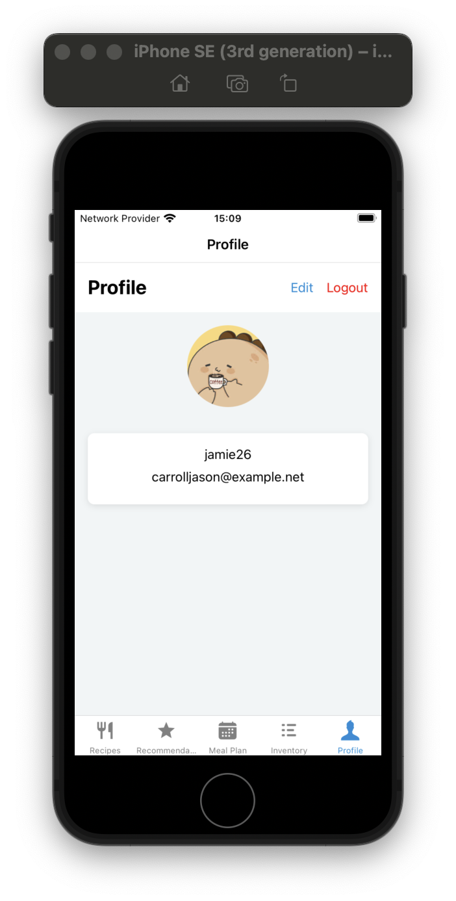 | 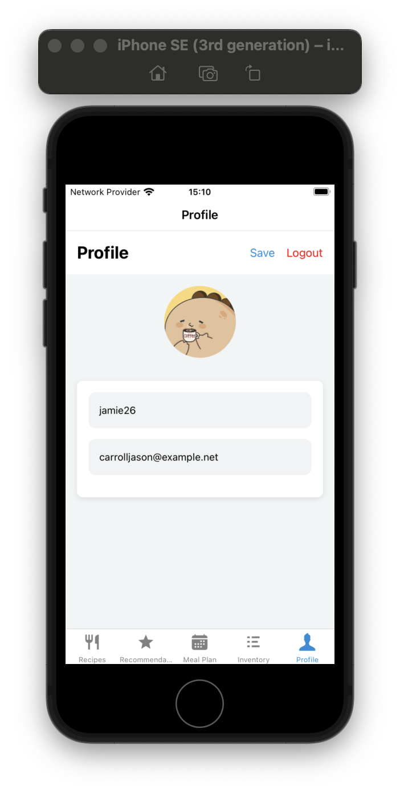 |

### 3. Recipe Management
- **Recipe Listings**: Users can browse recipes categorized by meal type (e.g., Breakfast, Lunch, Dinner).
- **Recipe Details**: View detailed instructions, ingredients, and user interactions like likes and comments.

| Recipe Listings | Recipe Details |
|-----------------|----------------|
| 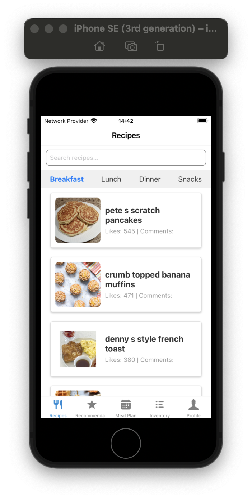 | 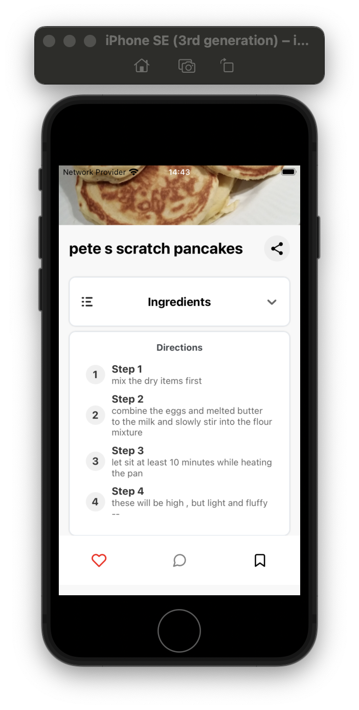 |

### 4. Recommendations
- **Ingredient-based Recommendations**: Users can enter ingredients they have, specify preferences, and receive tailored recipe suggestions.
- **Recipe Recommendations**: Display recipes based on themes or dietary goals, like "High Protein" or "Low Calories."
- **Detailed Recommendations**: Displays a list of recipes under a selected theme or dietary goal.

| Ingredient-based Recommendations | Recipe Recommendations | Detailed Recommendations |
|----------------------------------|------------------------|--------------------------|
| 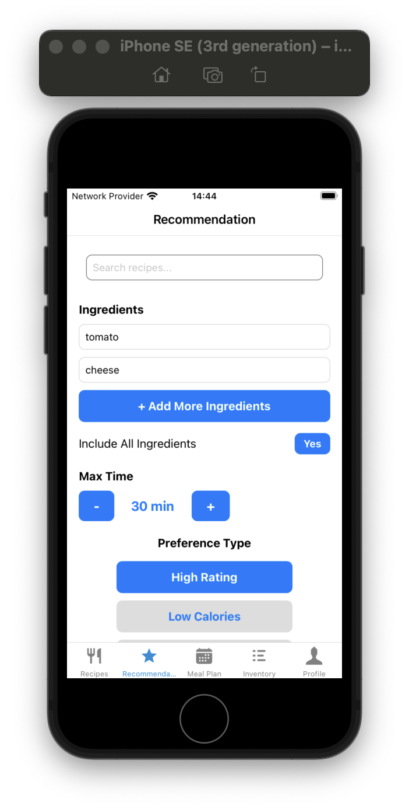 | 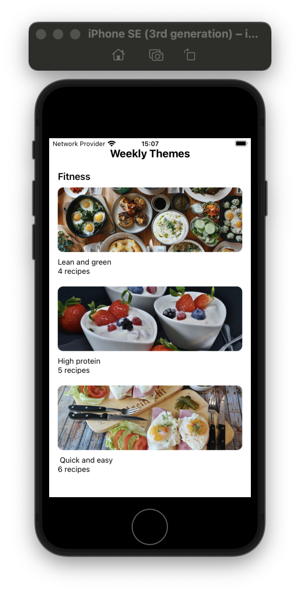 |  |

### 5. Meal Planning
- **Weekly Meal Planner**: Plan meals by selecting recipes for each day of the week, categorized by meal type (Breakfast, Lunch, Dinner).

| Weekly Meal Plan |
|------------------|
| 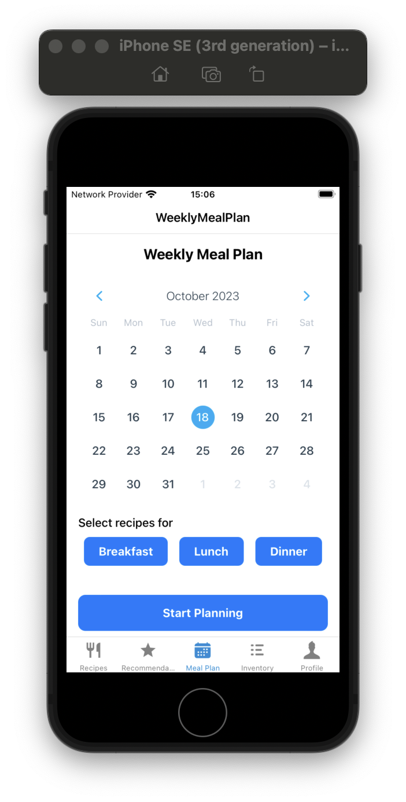 |

### 6. Inventory Management
- **Inventory Tracking**: Add, edit, and manage food items in the inventory. Track quantities and units.
- **Inventory Item Details**: View detailed information of each inventory item, with options to update quantities and units.

| Inventory Tracking | Inventory Item Details |
|--------------------|------------------------|
| 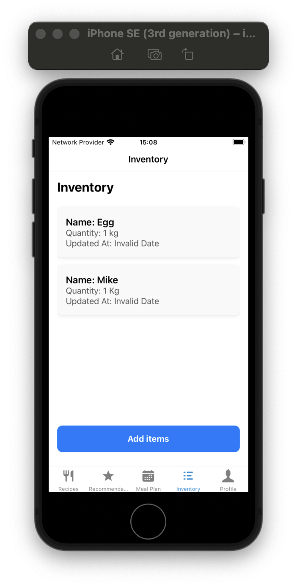 | 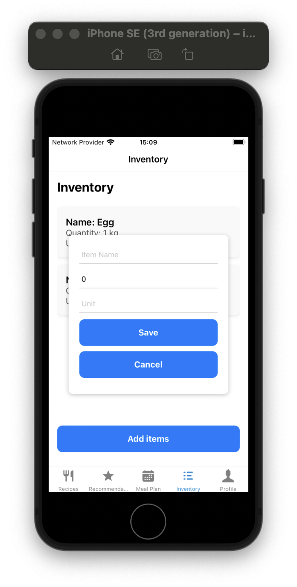 |

## Installation

1. Clone the repository:
   ```bash
   git clone https://github.com/yourusername/recipe-management-app.git
   cd recipe-management-app
   ```

2. Install dependencies:
   ```bash
   npm install
   ```

3. Run the app in Expo for iOS:
   ```bash
   expo start --ios
   ```
   _Note: Android support will be added soon._

## Usage

### Running Locally
This app requires Expo to run on a local device or simulator. After installation, use the Expo CLI to load the app on your preferred device.

## Demo

Watch the [RecipesApp demo.mov](Demo/RecipeApp Demo without voice.mov) to see the app in action.

## Contributing

1. Fork the repository.
2. Create a new branch:
   ```bash
   git checkout -b feature-name
   ```
3. Commit your changes and open a pull request.

## License

This project is licensed under the MIT License.

## Notes

1. Replace `path/to/` in image links with the actual file paths for each uploaded image and demo video.
2. Confirm that the video path is accessible and correctly formatted for viewing.
3. Additional rows and columns can be added or modified as necessary.
